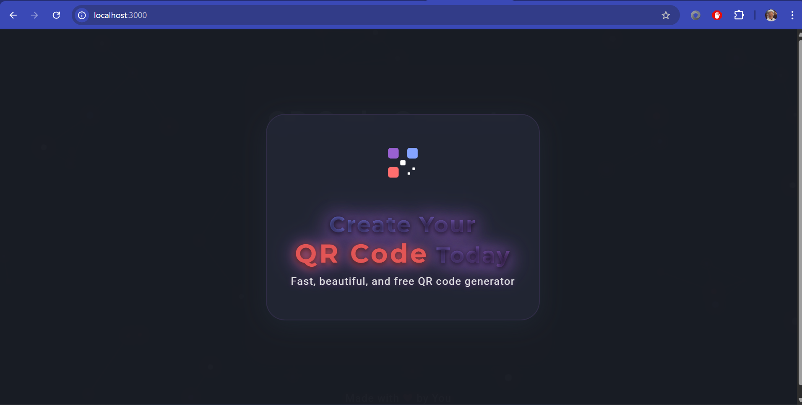
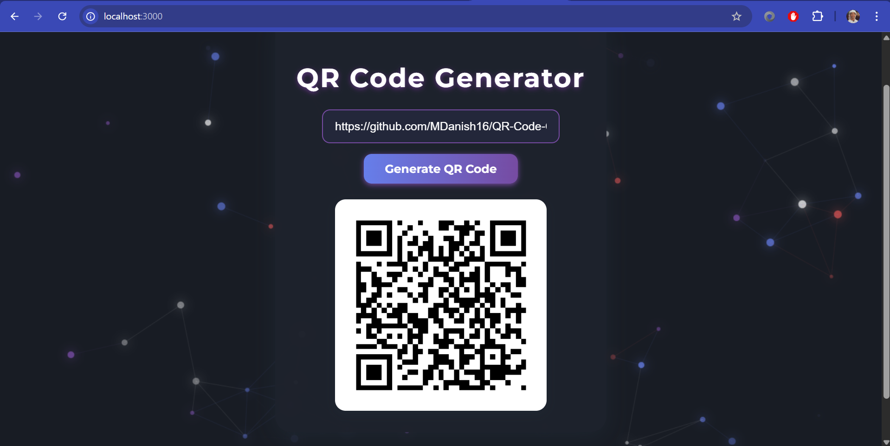

# 🚀 Creative QR Code Generator

A beautiful, dark-themed QR Code Generator built with **Node.js** and **Express**. This project features a stunning animated background, a modern user interface, and a welcoming intro screen. Instantly generate QR codes for any URL — in style!

## ✨ Features

* **Dark Themed UI** – Modern, elegant, and easy on the eyes
* **Animated Welcome Page** – Eye-catching glassmorphism card with animated QR icon
* **Live Moving Wallpaper** – Smooth, animated particles for a dynamic background
* **Instant QR Code Generation** – Enter any URL and get a QR code in seconds
* **Responsive & Creative Design** – Works beautifully on both desktop and mobile

## 🖥️ Demo

### Welcome Page



### Working QR Generator



## 🚦 Getting Started

1. **Clone the repository**

   ```bash
   git clone https://github.com/MDanish16/QR-Code-Generator.git
   cd QR-Code-Generator
   ```

2. **Install dependencies**

   ```bash
   npm install
   ```

3. **Start the server**

   ```bash
   node server.js
   ```

4. **Open in your browser**
   Go to [http://localhost:3000](http://localhost:3000)

## 🛠️ Project Structure

```
public/
  ├── index.html      # Main frontend
  ├── style.css       # Creative dark theme styles
  ├── script.js       # Frontend logic
  ├── wallpaper.js    # Animated background
welcome.png           # Screenshot of welcome page
working.png           # Screenshot of working app
server.js             # Express backend & QR code API
```

## 📦 Dependencies

* Express
* qrcode
* cors

## 💡 Customization

* Edit `public/style.css` for colors, fonts, and animations
* Change the welcome overlay in `public/index.html`
* Tweak the animated wallpaper in `public/wallpaper.js`

## 📝 License

MIT

---

